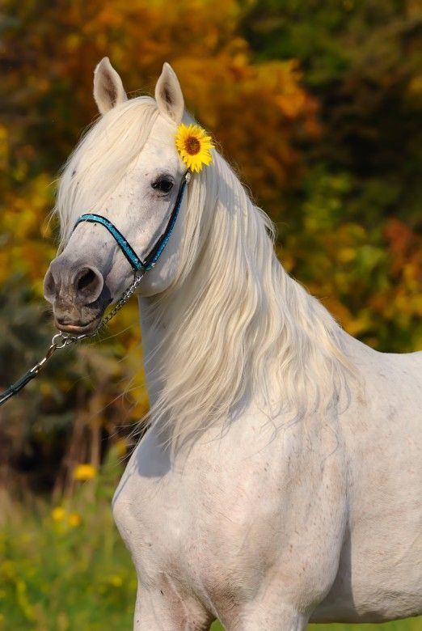

# Neural Style Transfer

*A Deep Learning Project using Convolutional Neural Networks (CNNs)*

---

## Overview

Neural Style Transfer (NST) is a computer vision technique that blends two images — a **content image** and a **style image** — to create a new, stylized output.
The model uses a pretrained convolutional neural network (usually **VGG19**) to extract feature representations and optimize a generated image to match the **content** of one image and the **style** of another.

---

## Project Structure

```
neural-style-transfer/
│
├── data/
│   ├── content.jpg
│   ├── style.jpg
│   └── result.jpg
│       
│
├── models/
│   └── vgg.py
│
├── utils/
│   ├── image_loader.py
│   ├── image_saver.py
│   └── display_utils.py
│
├── requirements.txt
├── README.md
└── main.py
```

---

## Requirements

Install dependencies using:

```bash
pip install -r requirements.txt
```

Typical dependencies:

```txt
torch
torchvision
numpy
Pillow
matplotlib
tqdm
```

---

## How It Works

1. **Load Images:** Load the content and style images, and preprocess them for the CNN.
2. **Feature Extraction:** Use a pretrained VGG19 model to extract feature maps.
3. **Loss Calculation:**

   * **Content Loss:** Measures the difference between generated and content features.
   * **Style Loss:** Measures the Gram matrix difference between generated and style features.
4. **Optimization:** Update the generated image iteratively using gradient descent (typically **L-BFGS** optimizer).
5. **Output:** Save and visualize the stylized image.

---

## Displaying Images

### In **Python (Jupyter Notebook)**:

```python
import matplotlib.pyplot as plt
from PIL import Image

# Load and display image
img = Image.open("data/outputs/result.jpg")
plt.imshow(img)
plt.axis("off")
plt.show()
```

## Running the Project

**Option 1 – Run the main script**

```bash
python main.py --content data/content.jpg --style data/style.jpg --epochs 300
```

**Option 2 – Use Jupyter Notebook**

```bash
jupyter notebook notebooks/neural_style_transfer.ipynb
```

---

## Example Results

| Content Image                | Style Image              | Output                             |
| ---------------------------- | ------------------------ | ---------------------------------- |
|  |  |  |

---

## References

* [Gatys et al., *A Neural Algorithm of Artistic Style*, 2015](https://arxiv.org/abs/1508.06576)
* [PyTorch NST Tutorial](https://pytorch.org/tutorials/advanced/neural_style_tutorial.html)

---

## Author

**Urvi Bhat**
